# ThRoUnityPlaygroundAddOns

UnityPlayground is a "`collection of simple scripts to create 2D physics games, intended for giving workshops to an audience of beginner game developers to quickly enable them to make games in Unity.`"
You found it on [GitHub](https://github.com/Unity-Technologies/UnityPlayground) or in Asset-Store. Search for "*Unity Playground*". **Please install first Unity-Playgroud before you install this Asset.**
## Reasons and motivation
After I start to create a small game with Unity Playground, I quickly reached the limits of the existing scripts. So, I created some Add-on for Unity Playground, to create a small 2D Game which is included in Examples-Folder.
## Dependencies
Before you import my Add-on, you must import the Unity Playground asset. For the Example Game, I used also to free Assets. First "FreeParallax" from Jeff Johnson. You found it in Asset-Store, search for "*Free Parallax for Unity (2D)*". The second is "*Knight Sprite Sheet (Free)*". **Please install them before you use the Examples.**\
Please read also the documentation of Unity Playground. 
## The AddOns
I created a different kind of Add-ons. Form Movement, Gameplay, Condition, Action and User Interface.
### Movement Add-ons
With the Movement Add-ons you can control the movement of Players or Enemy’s in your game. Don’t forget to add a Rigidbody2D to produce movement. If you need to interact with other objects, you also have to add a Collider2D
#### 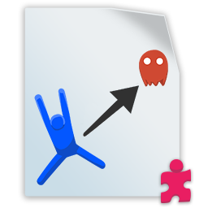 FleeFromTarget
With this Script you can control, that an "Enemy" is move away from the "Player", when he is too close to them\
**Requires:** Rigidbody2D

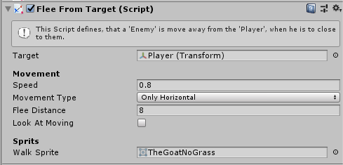

When you assign the script to an enemy and use the player as a target, the enemy will flee away from player, when the player is closer then the flee distance. As closer the player is, as faster the enemy is fleeing away. You can control the maximum speed by change the value of the “Speed” field. 
When you mark the option “Look At Moving” the Object automatically flip the sprite in the direction in which he is moving.
If you assign in “Walk Sprite” a Sprite object, this will automatically will show when the object is moving.

####  FollowPlayer
This Script is copy of the FollowTarget script. This variant flip's the sprite in the direction in which the figure moves.
#### 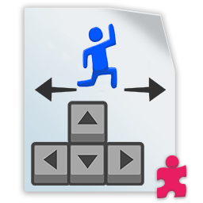 PlayerMove
This script is a variant of the Move script, it reflects the sprite in the direction in which the player moves.
### Gameplay Add-ons
#### 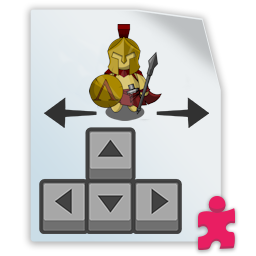 Warrior
This script is for the control of a warrior. This can be moved, an attack button and a small animation to be controlled
## Condition Add-ons
The Unity Playground Documentation writes: “`Conditions are very similar to If Statements in programming, meaning that they act as a gateway to other behaviours. If the condition is verified, then the attached Actions are executed`”. My Conditions are mainly used to respond to a player's attacks.
#### 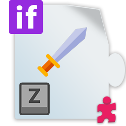 ConditionAttack
This condition checks if the object is exposed to an attack. It is checked if there is a collision with the player and the attack button is pressed.
#### 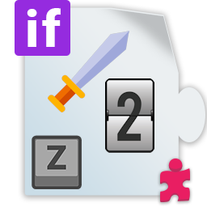 ConditionAttackCountDown
This condition checks if the object is exposed to an attack. It is checked if there is a collision with the player and the attack button is pressed. However, the condition was only when the attack was repeated several times.\
**Requires:** Collider2D

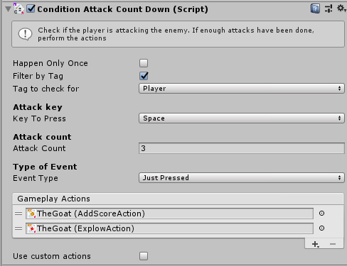

You have two options to assign the enemy and the player. When you assign the script to an enemy and select the option “Filer by Tag”, you must select the Tag which is assign to the player. The sript will find automatically the player object. If you deselect the “Filer by Tag” option, you can assign the object manually.

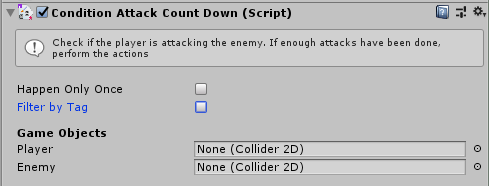

With the field “Attack Count” you control, how many hit’s the assigned object must get, before the condition is true. In addition to choosing which key with Key to Press, you can choose which type of key event to listen to with Event Type: Just Pressed (like GetKeyDown), Released (GetKeyUp) or Kept Pressed (GetKey). As with other continuous actions, Kept Pressed mode has a Frequency property.

### Action Add-ons
#### 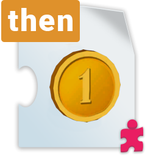 AddScoreAction
When this action is taken, the player gets the given points
#### 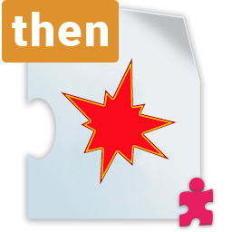 ExplowAction
When performing this action, plays a specified sequence of sprites to simulate an explosion.
### User Interface Add-ons
### 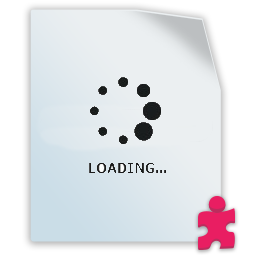 SplashScreen
You can use this script show a Splash Screen at beginning of the game.
## Example Script
These scripts have been made especially for the example game but can also be used for own games. In future I plan to rebuild the and offer them as an Add-on.
### 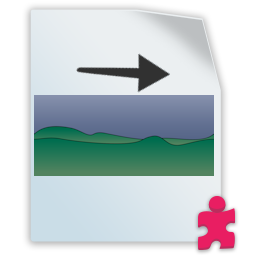 MoveBackgroundParallax
Together with the Asset "FreeParallax" you can create a background witch never ended.
For using this Script build a similar Object-Tree in your game. 

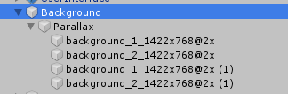

First create an empty Game Object and name its Background. As a child create an empty Game Object and name is Parallax. To the Parallax Object assign the script “FreeParallax” from folder “FreeParallax/Scripts”. Add per drag and drop your background images as children of Parallax. You need minimum two images.

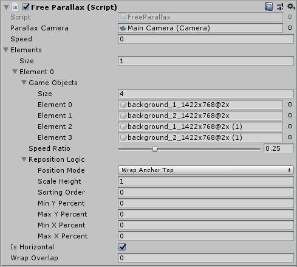

Assign the Main Camera to the Script end set speed to 0. Under Elements, enter 1 to Size. Then under Element 0 / Game Objects enter the count of your background images. Please try out witch Speed Ration is the best for your game. Some time you need to change the other Options. Please try out which is the best for your game.
To the Background object assign this script MoveBackgroundParallax.

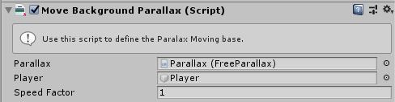
 
Assign the Parallax Object and the Player. With “Speed Factor” you can control the over all speed. Please try out which is the best for your game.

###  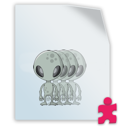 EnemyMultiply
With this script several objects can be created from one game object. These can also be randomly distributed on the X-axis.
For using this Script build a similar Object-Tree in your game.

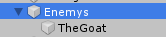

First create an empty Game Object and name its Enemys. Now place your Enemy object to this object as a child. Then assign the script EnemyMultiply to the Enemys object.

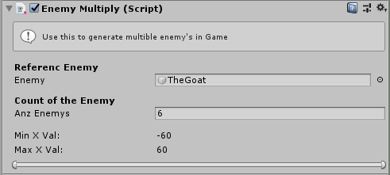

Assign your Enemy you want to multiply to the Enemy field. Enter in the field, how much enemy´s you want to be created. Please remember, when you start the game, in this example you will have 7 enemy. The one you placed under the Enemys object and 6 witch the script crated. With the slider on bottom of the editor window, you can set the random range, on which the enemies are paced on the x-axis.
