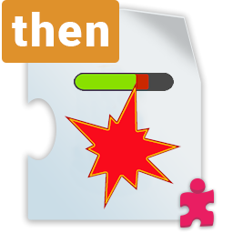

# ThRoUnityPlaygroundAddOns

UnityPlayground is a "`collection of simple scripts to create 2D physics games, intended for giving workshops to an audience of beginner game developers to quickly enable them to make games in Unity.`"
You found it on [GitHub](https://github.com/Unity-Technologies/UnityPlayground) or in Asset-Store. Seach for "*Unity Playground*". **Please install first Unity-Playgroud befor you install this Asset.**
## Reasons and motivation
After I start to crate a smale game with Unity Playground, I quickly reached the limits of the existing scripts. So I created some AddOn for Unity Playground, to create a smale 2D Game witch is included in Examples-Folder.
## Dependencies
For the Example I used also to free Assets. First "FreeParallax" from Jeff Johnson. You found it in Asset-Store, search for "*Free Parallax for Unity (2D)*". The second is "*Knight Sprite Sheet (Free)*". **Please install them befor you use the Examples.**

## AddOns
The AddOn included following Parts:
### Movement Script FleeFromTarget

With this Script you can controle, that a "Enemy" is move away from the "Player", when he is to close to them.

### Movement Script FollowPlayer

### Movement Script PlayerMove

### Condition ConditionAttack

### Condition ConditionAttackCountDown

### Action AddScoreAction

### Action ExplowAction

### Example Script MoveBackgroundParallax

