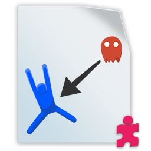

# ThRoUnityPlaygroundAddOns

UnityPlayground is a "`collection of simple scripts to create 2D physics games, intended for giving workshops to an audience of beginner game developers to quickly enable them to make games in Unity.`"
You found it on [GitHub](https://github.com/Unity-Technologies/UnityPlayground) or in Asset-Store. Seach for "*Unity Playground*". **Please install first Unity-Playgroud befor you install this Asset.**
## Reasons and motivation
After I start to crate a smale game with Unity Playground, I quickly reached the limits of the existing scripts. So I created some AddOn for Unity Playground, to create a smale 2D Game witch is included in Examples-Folder.
## Dependencies
For the Example I used also to free Assets. First "FreeParallax" from Jeff Johnson. You found it in Asset-Store, search for "*Free Parallax for Unity (2D)*". The second is "*Knight Sprite Sheet (Free)*". **Please install them befor you use the Examples.**

## AddOns
The AddOn included following Parts:

### Movement Script FleeFromTarget

With this Script you can controle, that a "Enemy" is move away from the "Player", when he is to close to them.

### Movement Script FollowPlayer

This Script ist copy of the FollowTarget script. This variant flip's the sprite in the direction in which the figure moves.

### Movement Script PlayerMove

This script is a variant of the Move script, It reflects the sprite in the direction in which the player moves.

### Warrior

This script is for the control of a warrior. This can be moved, an attack button and a small animation to be controlled

### Condition ConditionAttack

This condition checks if the object is exposed to an attack. It is checked if there is a collision with the player and the attack button is pressed.

### Condition ConditionAttackCountDown

This condition checks if the object is exposed to an attack. It is checked if there is a collision with the player and the attack button is pressed. However, the condition was only when the attack was repeated several times.

### Action AddScoreAction

When this action is taken, the player gets the given points

### Action ExplowAction

When performing this action, plays a specified sequence of sprites to simulate an explosion.

## Example Script
These scripts have been made especially for the example game, but can also be used for own games

### MoveBackgroundParallax

Together with the Asset "FreeParallax" you can create a background witch never endet. 

###  EnemyMultiply

With this script several objects can be created from one game object. These can also be randomly distributed on the X-axis.
